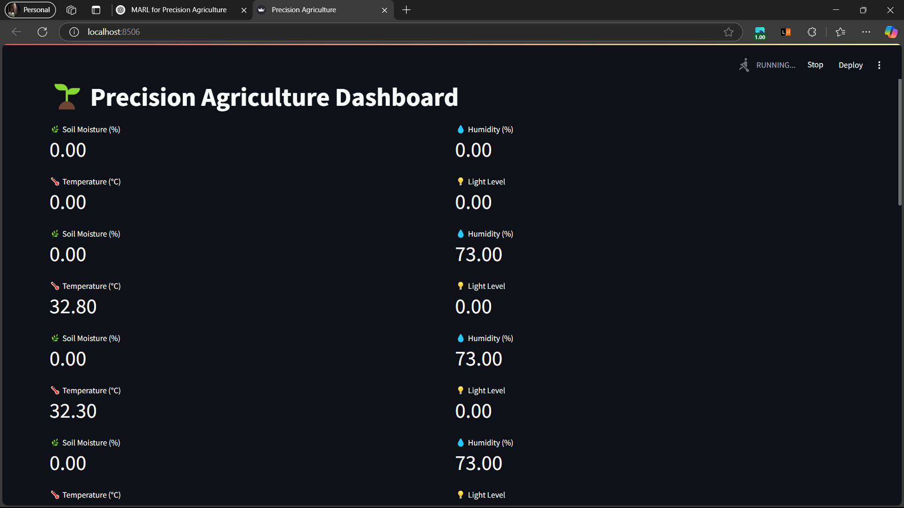
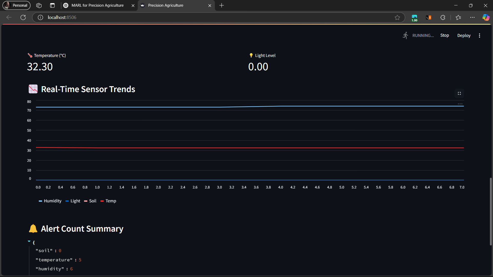

# 🌱 Precision Agriculture Monitoring System with Q-Learning and Real-Time Dashboard

An intelligent, real-time agriculture monitoring system using Q-learning agents, IoT sensors (ESP32), and a live Streamlit dashboard. Designed to optimize resource usage and automate anomaly alerts for parameters like soil moisture, temperature, humidity, and light.

---

## 🧠 Key Features

- 🔁 **Reinforcement Learning (Q-Learning)** for decision-making
- 🌐 **Streamlit Dashboard** for real-time visualization
- 📟 **ESP32 + Sensors** (Soil, Temp, Humidity, Light) as IoT edge devices
- ☁️ **Adafruit IO Integration** for cloud logging
- 📲 **Fast2SMS Alerts** for anomaly detection and emergency response
- 🧠 **Multi-Agent RL**: One agent per sensor for independent learning

---

## 🛠️ Technologies Used

| Component      | Technology             |
|----------------|------------------------|
| Microcontroller | ESP32                 |
| Programming    | Python, Arduino C      |
| ML Algorithm   | Q-Learning             |
| Dashboard      | Streamlit              |
| Serial I/O     | PySerial               |
| Cloud Logging  | Adafruit IO            |
| Alerts         | Fast2SMS API           |

---

## 🖼️ System Architecture

[ESP32 Sensors]
    ↓ (Serial)
[Python Script]
    ├── Q-Learning Agents
    ├── Streamlit Dashboard
    ├── Adafruit IO Logging
    └── Fast2SMS Alerts
ESP32 Development Board

Soil Moisture Sensor

DHT11/DHT22 (Temperature & Humidity)

LDR for Light Intensity

USB connection to PC

git clone https://github.com/your-username/agri-dashboard
cd agri-dashboard

pip install -r requirements.txt

streamlit run agri_dashboard.py

ESP32 reads sensor values every second.

Sends data via serial to Python app.

Each sensor's Q-learning agent selects an action (Wait, Actuate, Alert).

If alert-worthy, SMS is sent using Fast2SMS.

Data is pushed to Adafruit IO and displayed on a real-time dashboard.

Actions: 0 = Wait, 1 = Actuate, 2 = Alert

State: Raw sensor value (e.g., soil moisture level)

Reward: Based on safety thresholds (e.g., alerting only when needed)

Policy: ε-greedy with decay

## 📸 Screenshots

### 🔹 Live Metrics View

### 🔹 Real-Time Sensor Chart

### 🔹 Alert Count Summary

